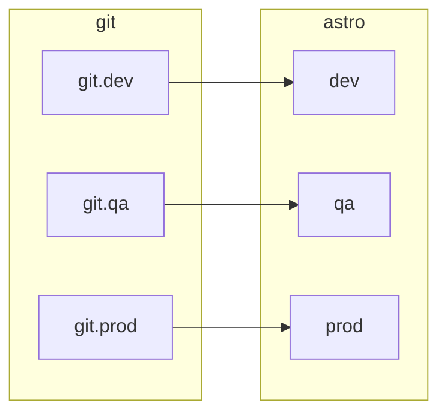
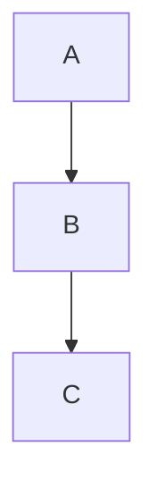

# rafa-repo-example
An example of a repo for an Astro deployment

# This is used for a set of deployments
It contains the following branches
* `dev`
* `qa`
* `prod`

# Folder structure

```
├── Dockerfile
├── LICENSE
├── README.md
├── airflow_settings.yaml
├── dags
│   ├── example_dag_advanced.py
│   └── example_dag_basic.py
├── include
├── packages.txt
├── plugins
├── requirements.txt
└── tests
    └── dags
        └── test_dag_integrity.py
```

# CI/CD Process



# Mermaid Example
